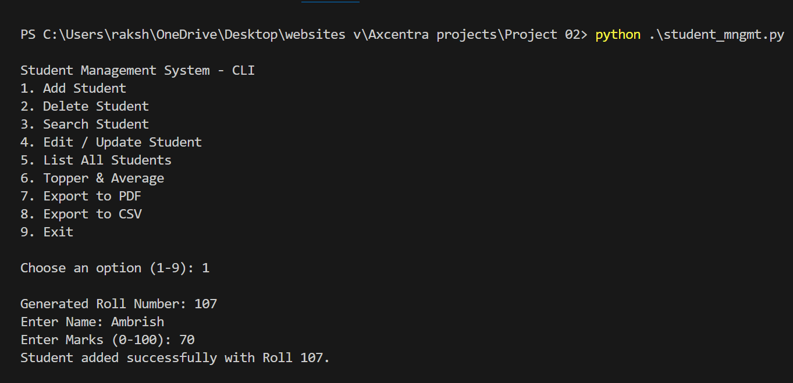
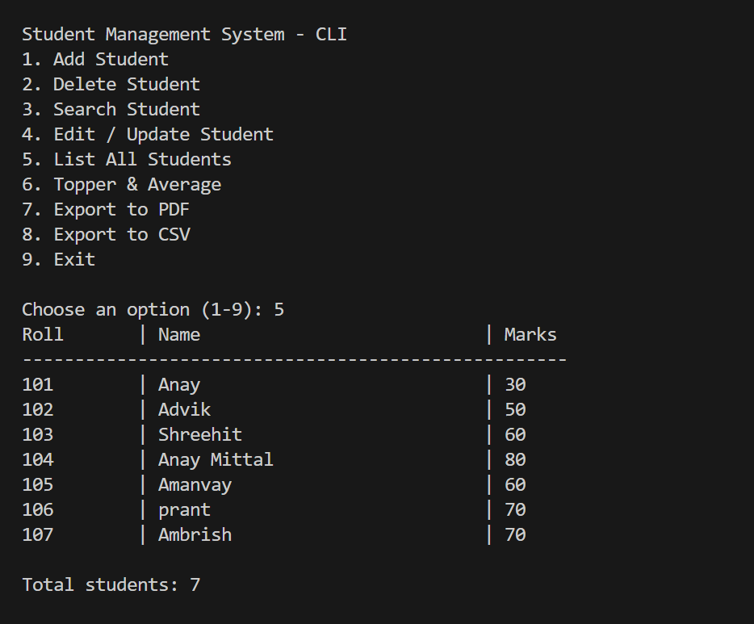
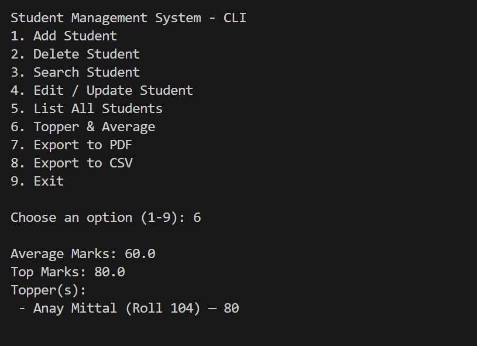

# 🎓 Student Management System — Python (CLI + CSV)

A command-line based **Student Management System** developed in Python that allows users to manage student records efficiently with **permanent storage using CSV**.  
This project includes full **CRUD operations**, **Topper & Average calculation**, and **PDF/CSV report export**.

---

## 📸 Project Screenshot
> Sample execution of the Student Management System





---

## 🚀 Features
| Functionality | Status |
|--------------|--------|
| Add Student | ✔ |
| Delete Student | ✔ |
| Search Student | ✔ |
| Edit / Update Student | ✔ |
| List All Students | ✔ |
| Topper & Average Marks | ✔ |
| Export to CSV | ✔ |
| Export to PDF (ReportLab) | ✔ |
| Permanent Data Storage in `students.csv` | ✔ |

---

## 📦 Tech Stack
| Technology | Purpose |
|------------|---------|
| Python | Core development |
| CSV | Data storage || PDF export |

---

## 📂 Folder Structure
```
Project Folder/
│── student_mgmt_cli.py
│── students.csv
│── students_export.csv (generated)
│── README.md
```

---

## ▶️ How to Run the Project

#### 1️⃣ Install dependencies (PDF export only)
```bash
pip install reportlab
```

#### 2️⃣ Run the program
```bash
python student_mgmt_cli.py
```

---

## 📊 Output Sample

✔ Student added successfully  
✔ Records listed in tabular format  
✔ Topper & Average calculated  
✔ Report exported as PDF and CSV  

---

## 🎯 Learning Outcomes
By making this project, I learned:
- Python File I/O  
- CRUD logic for real-world applications  
- Working with CSV data storage  
- Modular and clean coding  
- Optional PDF report generation  

---

## 👤 Author
**Vanshika Gupta**

## 🏢 Internship
**Axcentra**

---

## ⭐ Feedback & Contributions
Pull Requests and Suggestions are welcome!  
If you like this project, don't forget to **⭐ Star the Repository**!

